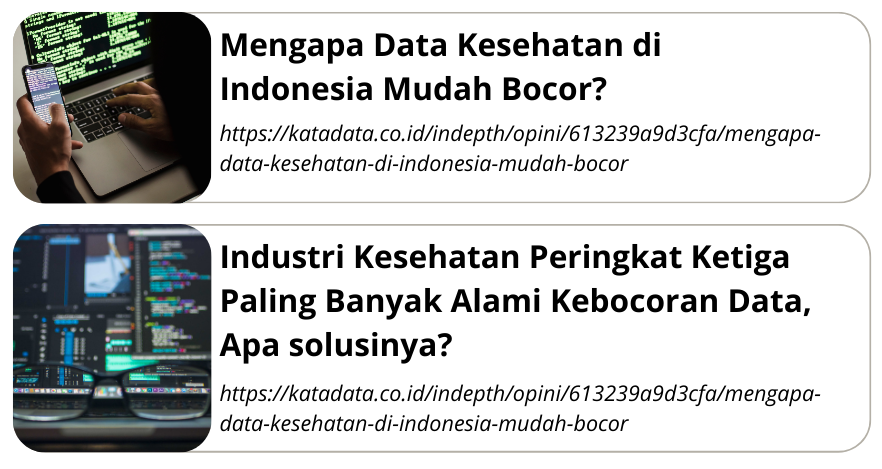
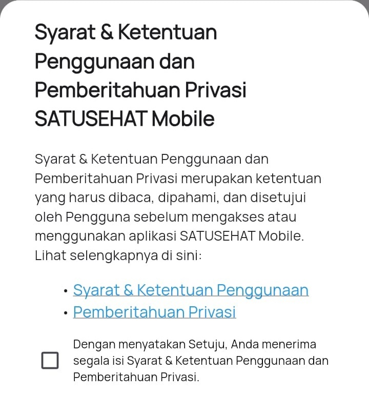
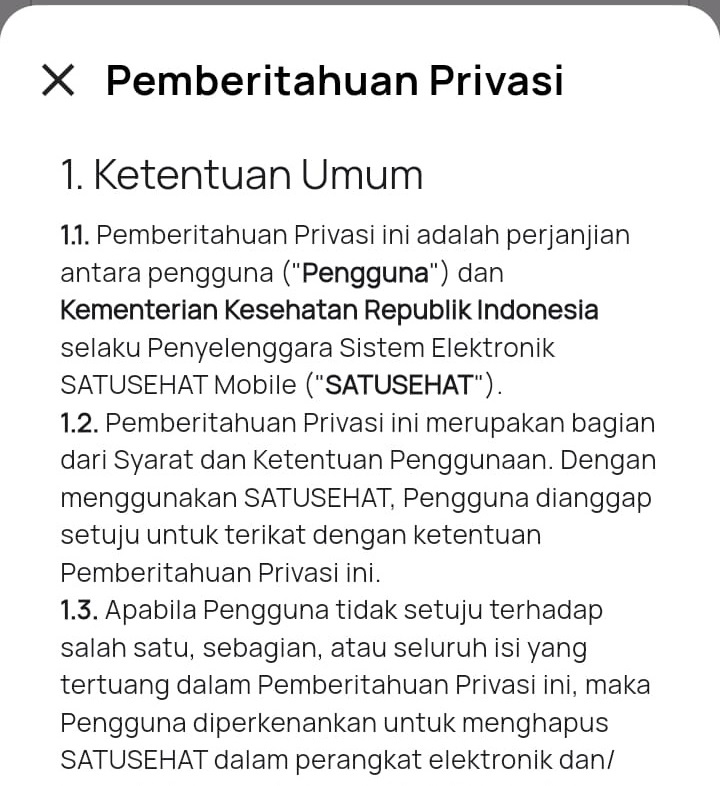

# Etika, Keamanan, dan Privasi Data dalam SIK {.example}

[SIK](#) | [Dimas BC Wicaksono](#)

---

## Outline {.revealx}

- [Pendahuluan](#intro)
- [Etika dalam SI](#etika)
- [Keamanan dalam SI](#keamanan)
- [Privasi Data](#privasi-data)
- [Tantangan](#tantangan)

---

## Pendahuluan {#intro}

{}- [Sistem Informasi Kesehatan](#intro), adalah kombinasi dari teknologi informasi dan komunikasi yang digunakan untuk mengelola informasi kesehatan pasien, seperti rekam medis elektronik (Electronic Health Record - EHR) dan data kesehatan lainnya.{}

{}- Sistem ini memungkinkan penyedia layanan kesehatan untuk mengakses data pasien dengan cepat dan akurat, meningkatkan kualitas perawatan dan efisiensi layanan kesehatan.{}

---

---

# Etika dalam SI 

---

## Etika dalam SI {#etika}

- Etika, Prinsip moral yang membedakan antara yang benar dan yang salah, yang baik dan yang buruk, dalam konteks perilaku manusia.
- Prinsip-prinsi utama etika dalam sistem informasi
  - Privasi
  - Kerahasiaan
  - Kepemilikan
  - Akuntabilitas
  - Transparansi

---

### Etika SI: Privasi {#privasi}

Hak individu untuk mengendalikan informasi pribadi mereka. 

{} Pengguna harus diberi tahu bagaimana data mereka akan dikumpulkan, {} 
{} digunakan, dan {} {} disimpan, {} {} serta diberi pilihan untuk menyetujui atau menolak penggunaan tersebut. {}

---

### Etika SI: Kerahasiaan {#kerahasiaan}

{} Menjaga informasi pribadi atau sensitif {} {} agar tidak diakses atau diungkapkan tanpa izin yang sah. {}
 
 
{} [**_perlindungan data dari akses yang tidak sah_**](#kerahasiaan) {}

---

### Etika SI: Kepemilikan {#kepemilikan}

{}Mengakui hak kepemilikan atas informasi dan{} {}menghormati hak cipta serta kekayaan intelektual. {}
 
 
{}Ini termasuk penggunaan legal perangkat lunak dan konten digital.{}

---

### Etika SI: Akuntabilitas {#akuntabilitas}

Tanggung jawab individu atau organisasi atas tindakan mereka dalam mengelola informasi. 
 
 
{}[Harus ada mekanisme untuk memonitor dan melaporkan penggunaan informasi](#akuntabilitas){}

--- 

### Etika SI: Transparansi {#transparansi}

Keterbukaan dalam pengelolaan informasi, termasuk bagaimana data dikumpulkan, digunakan, dan dilindungi. 
 
 
{}[Pengguna harus bisa memahami kebijakan dan praktik terkait data mereka](#transparansi){}

---

# Keamanan dalam SI 

---

## Keamanan dalam SI {#keamanan}

Serangkaian kebijakan, prosedur, dan langkah-langkah teknis {}yang digunakan untuk melindungi informasi dan sistem informasi {} {} dari akses, penggunaan, pengungkapan, gangguan, modifikasi, atau perusakan yang tidak sah.{}

---

## Tujuan Keamanan SI {#tujuan-keamanan}

{}- [Kerahasiaan](#tujuan-keamanan) (*Confidentiality*), Menjaga informasi agar hanya dapat diakses oleh pihak yang berwenang.{}

{}- [Integritas](#tujuan-keamanan) (*Integrity*), Menjaga keakuratan dan keutuhan informasi dari perubahan yang tidak sah.{}

{}- [Ketersediaan](#tujuan-keamanan) (*Availability*), Memastikan informasi dan sumber daya terkait tersedia bagi pengguna yang berwenang ketika diperlukan.{}

---

## Ancaman terhadap Keamanan SI

- Serangan Siber: Malware, Ransomware, Phishing, Denial of Service (DoS)
- Insider Thread, Ancaman dari orang dalam 
- Kesalahan Manusia, Kesalahan dalam pengelolaan data atau konfigurasi 

---

## Langkah-langkah Keamanan {#langkah-keamanan}

- Kontrol Akses: Autentikasi dan Otoritas
- Enkripsi
- Firewall
- Patch Management
- Backup dan Pemulihan Data

---

## Kebijakan dan Prosedur Keamanan

{}- Sangat penting bagi sebuah sistem informasi memiliki kebijakan tentang keamanan informasi yang berisi tentang aturan dan pedoman untuk perlindungan data{}

{}- Memiliki prosedur tanggap insiden yang terstruktur untuk merespon dan mengelola insiden keamanan secara efektif. Termasuk identifikasi, penahanan, pemulihan, dan analisis pasca-insiden.{}

---

# Privasi Data 

### UU 27 Tahun 2022

---

## Privasi Data {#privasi-data}

{}- Privasi data adalah hak individu untuk mengendalikan informasi pribadi mereka. {}

{}- UU 27 Tahun 2022 menjelaskan bahwa berdasarkan sifatnya, data pribadi dibagi menjadi 2
  - Data Pribadi yang bersifat spesifik
  - Data Pribadi yang bersifat umum
{}

{}- [Pelindungan Data Pribadi masuk dalam pelindungan hak asasi manusia.](#privasi-data){}

---

## Data Pribadi Spesifik

- data dan informasi kesehatan,
- data biometrik,
- data genetika,
- catatan kejahatan,
- data anak,
- data keruangan pribadi, dan/ atau
- data lainnya sesuai dengan ketentuan peraturan
perundang-undangan.

---

## Data Pribadi Umum

- nama lengkap,
- jenis kelamin,
- kewarganegaraan,
- agama,
- status perkawinan, dan/ atau
- Data Pribadi yang dikombinasikan mengidentifikasi seseorang

---

Setiap warga negara diwajibkan untuk melakukan pengendalian terhadap data pribadi.

{}Pemerintah?{} {}Membuat regulasi,{} {}sistem,{} {}infrastruktur,{} {}dan sumber daya yang kompeten.{}

---

## Ancaman terhadap Privasi Data

- Pencurian Identitas
- Peretasan
- Penggunaan data tidak sah

---

## Bagaiman Kita Melindunginya?

{}- Penggunaan sandi yang kuat
{}

{}- Pengamanan perangkat, gunakan layanan keamanan
{}

{}- Perhatikan dan periksa kebijakan privasi
{}

{}- Berhati - hati terhadap penipuan
{}

{}- Mengikuti pendidikan seperti sosialisasi, seminar, dsb.
{}

---

## Bagaimana dengan Pemerintah?

Seperti yang telah dijelaskan sebelumnya pada [Langkah - langkah Keamanan Sistem Informasi](#langkah-keamanan)
- Kontrol Akses: Autentikasi dan Otoritas
- Enkripsi
- Firewall
- Patch Management
- Backup dan Pemulihan Data

---

### Contoh Syarat & Ketentuan Pengguna

  

---

### Contoh Syarat & Ketentuan Pengguna

---

# Tantangan

- Kerentanan terhadap Serangan Siber, seperti yang terjadi pada eHAC dan BPJS Kesehatan.
- Pemahaman Hukum dan Kepatuhan, banyak institusi kesehatan yang belum sepenuhnya memahami atau mematuhi regulasi terkait perlindungan data.

---

# Tantangan

- Keterbatasan teknologi dan anggaran.
- Sumber daya manusia
- Implementasi dan Penegakan Hukum masih lemah

---

# Questions?

[Ask](https://discord.gg/z8wNYzb)

[Documentation](https://docs.hugoblox.com/content/slides/)
